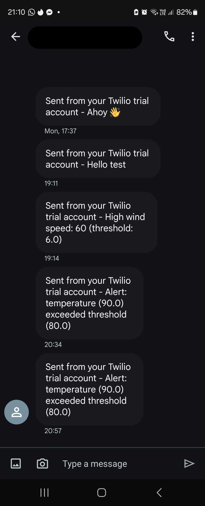

## InfluxDB 3 Core/Enterprise Phone Message alerts plugin

This plugin sends SMS/WhatsApp alerts via Twilio based on for any given threshold conditions with for  InfluxDB 3 Core/Enterprise. For example you can use the WAL Flush trigger to send an alert text message when a threhold is met. e.g Industrial IoT sensor temp > 100 degrees.

## Prerequisites

*   InfluxDB 3.0 Core/Enterprise running.
*   A Twilio account with an active phone number (free trial)
*   Phone number that recieves text message and/or WhatsApp message (Whatsapp is optional)
*   The `twilio` Python library installed (`influxdb3 install package twilio`).
*   The `python-dotenv` library installed (`influxdb3 install package python-dotenv`) - *Required for `.env` file*.

## Installation

1.  **Place the Plugin File:** Place the `sms-alert.py` file in your InfluxDB 3.0 plugin directory.

2.  **Install Dependencies using influxdb3 provided python support:**
    ```bash
    influxdb3 install package twilio
    influxdb3 install package python-dotenv
    ```

## Configuration

**1. Environment Variables (Required):**

 Open the file named `.env` and update the values with your Twilio credentials. 

    ```
    TWILIO_ACCOUNT_SID=ACxxxxxxxxxxxxxxxxxxxxxxxxxxxxx
    TWILIO_AUTH_TOKEN=your_auth_token
    TWILIO_FROM_NUMBER=your_twilio_no
    TWILIO_TO_NUMBER=recipient_phone_no
    TWILIO_FROM_WHATSAPP_NUMBER=your_twilio_whatsapp_no 
    TWILIO_TO_WHATSAPP_NUMBER=recipient_whatsapp_no
    ```

## WAL Flush Trigger Setup & Test

### 1. Create it (modify arguments as per your logic)
```bash
influxdb3 create trigger \
  --trigger-spec "all_tables" \
  --plugin-filename "sms-alert.py" \
  --database mydb \
  wal_alert \
  --trigger-arguments "field_name=temperature,threshold=80"
```

#### 2. Enable it
```bash
influxdb3 enable trigger --database mydb wal_alert
```

#### 2. Test it
```bash
test wal_plugin \
  --lp "weather,location=us-midwest temperature=90i 1678886400000000000" \
  --input-arguments "field_name=temperature,threshold=80" \
  --database mydb \
  sms-alert.py
```




